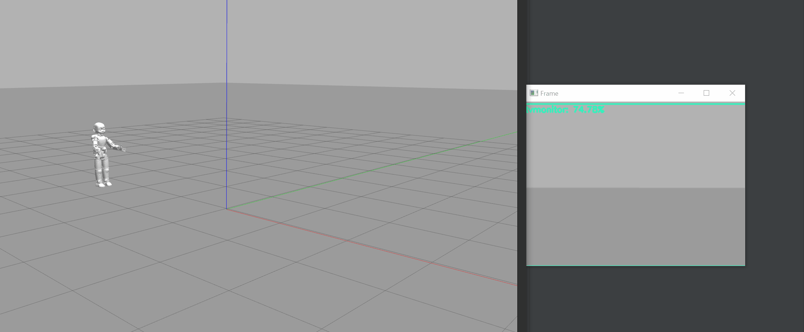

# iCub Gazebo Setup

 

The purpose of this repository is to guide you through the installation of YARP and Gazebo in such a way that importing an iCub model inside the simulation will automatically connect it to the Yarp server. We will also cover the installation of the Yarp python bindings and provide a simple python image recognition script with OpenCV.

## Install the Superbuild
The superbuild is comprised of different software developed by the [robotology GitHub organization](https://github.com/robotology/), such as the YARP middleware and the iCub gazebo models. To download the superbuild on windows you just need to access the [release page](https://github.com/robotology/robotology-superbuild/releases) and download and execute the full installer.
This will also install the Gazebo simulation environment and set up the PATH system variable.

## Compile the Python Bindings
To interact with the iCub model through YARP using python you will need to compile the python bindings using the Swig interface compiler.

First, you will need to install the last version of swigwin (the Swig executable for Windows) in your home directory:
1. Download the latest version of Swig from http://www.swig.org/download.html
2. Extract the content in your home directory
3. Include the swigwin directory in the windows PATH system variable ([how-to](https://www.imatest.com/docs/editing-system-environment-variables/))

Now install [CMake](https://cmake.org/) and [Visual Studio](https://visualstudio.microsoft.com/it/) with the "Desktop Development with C++" workload. They will be needed to compile the bindings.

Open CMake and specify the source code location (in our case *C:/robotology/robotology/share/yarp/bindings*), the build location (*C:/robotology/robotology/share/yarp/bindings/build*) and press **Configure**. A list of variables should appear in the upper part of the windows. 

Set the CREATE_PYTHON variable to True and press **Configure** again. You should be now able to press **Generate** and **Open Project** to open the build files in Visual Studio.
From Visual Studio you can finally click on Build -> Build Solution to generate the python bindings.

> ⚠️ If, while compiling the bindings, you get the error `LNK1104 cannot open file ‘python39_d.lib‘` you can find a detailed explanation of how to solve it at https://www.programmersought.com/article/63328449811/

Now that the build is compiled find the generated files *yarp.py*, *\_yarp.pyd*, *\_yarp.lib*, *\_yarp.exp* and *\_yarp.pdb* and add it to the PYTHONPATH environment variable. You should now be able to import yarp into your python projects.

## How to Use
With the superbuild installed and the bindings compiled you are ready to start the environment and reproduce the demo shown above.

1. Start the Yarp server by opening a command line and typing `yarpserver`.
2. Start the Gazebo simulation environment by opening a command line and typing `gazebo`.
3. Insert into Gazebo the *iCubGazeboV2_5_visuomanip* model from the insert pane on the left side of the screen.

As you complete this third step you will see the two terminals showing the connection between the Yarp server and the iCub model inside Gazebo.
After that, you can run the [icub-hello.py](icub-hello.py). This will open a small panel showing the visual feed of the iCub model processed by an object recognition algorithm.
If iCub detect a person it will greet him by raising his hand.

You can download the gazebo models (or just the *standing_person* model) from https://github.com/osrf/gazebo_models and move it in the gazebo_models directory (in our case *C:\Users\your-username\\.gazebo\models*).

### Credits
[Stefano Berti](https://github.com/StefanoBerti)

[Andrea Rosasco](https://andrearosasco.github.io/)
